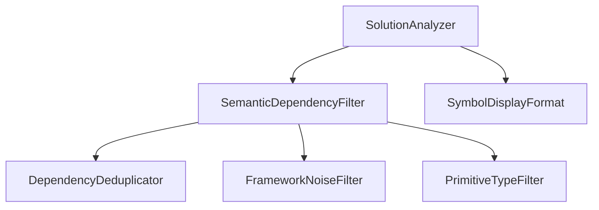

# Dependency Graph

## Semantic Dependencies

## BridgeMD.Roslyn.SolutionAnalyzer
- `BridgeMD.Roslyn.SemanticDependencyFilter` (Field, DependencyFilter)
- `Microsoft.CodeAnalysis.SymbolDisplayFormat` (Field, FullNameFormat)

## BridgeMD.Roslyn.SemanticDependencyFilter
- `BridgeMD.Roslyn.DependencyDeduplicator` (Field, _deduplicator)
- `BridgeMD.Roslyn.FrameworkNoiseFilter` (Field, _frameworkNoiseFilter)
- `BridgeMD.Roslyn.PrimitiveTypeFilter` (Field, _primitiveTypeFilter)

## Mermaid

## IoC Registrations

| Project | Interface | Implementation | Kind | Location |
| --- | --- | --- | --- | --- |
| none | none | none | none | none |
