# Dependency Graph

## Semantic Dependencies

## BlazorAdmin.Services.CatalogItemService
- `BlazorAdmin.Services.HttpService` (ConstructorInjection, CatalogItemService)
- `BlazorShared.Interfaces.ICatalogLookupDataService<BlazorShared.Models.CatalogBrand>` (ConstructorInjection, CatalogItemService)
- `BlazorShared.Interfaces.ICatalogLookupDataService<BlazorShared.Models.CatalogType>` (ConstructorInjection, CatalogItemService)

## Microsoft.eShopWeb.ApplicationCore.Services.BasketService
- `Microsoft.eShopWeb.ApplicationCore.Interfaces.IAppLogger<Microsoft.eShopWeb.ApplicationCore.Services.BasketService>` (ConstructorInjection, BasketService)
- `Microsoft.eShopWeb.ApplicationCore.Interfaces.IRepository<Microsoft.eShopWeb.ApplicationCore.Entities.BasketAggregate.Basket>` (ConstructorInjection, BasketService)

## Microsoft.eShopWeb.ApplicationCore.Services.OrderService
- `Microsoft.eShopWeb.ApplicationCore.Interfaces.IRepository<Microsoft.eShopWeb.ApplicationCore.Entities.BasketAggregate.Basket>` (ConstructorInjection, OrderService)
- `Microsoft.eShopWeb.ApplicationCore.Interfaces.IRepository<Microsoft.eShopWeb.ApplicationCore.Entities.CatalogItem>` (ConstructorInjection, OrderService)
- `Microsoft.eShopWeb.ApplicationCore.Interfaces.IRepository<Microsoft.eShopWeb.ApplicationCore.Entities.OrderAggregate.Order>` (ConstructorInjection, OrderService)
- `Microsoft.eShopWeb.ApplicationCore.Interfaces.IUriComposer` (ConstructorInjection, OrderService)

## Microsoft.eShopWeb.FunctionalTests.Web.Controllers.AccountControllerSignIn
- `Microsoft.eShopWeb.FunctionalTests.Web.TestApplication` (ConstructorInjection, AccountControllerSignIn)

## Microsoft.eShopWeb.FunctionalTests.Web.Controllers.CatalogControllerIndex
- `Microsoft.eShopWeb.FunctionalTests.Web.TestApplication` (ConstructorInjection, CatalogControllerIndex)

## Microsoft.eShopWeb.Infrastructure.Data.CatalogContext
- `DbContextOptions<Microsoft.eShopWeb.Infrastructure.Data.CatalogContext>` (ConstructorInjection, CatalogContext)
- `DbSet<Microsoft.eShopWeb.ApplicationCore.Entities.BasketAggregate.Basket>` (DbSet, Baskets)
- `DbSet<Microsoft.eShopWeb.ApplicationCore.Entities.BasketAggregate.BasketItem>` (DbSet, BasketItems)
- `DbSet<Microsoft.eShopWeb.ApplicationCore.Entities.CatalogBrand>` (DbSet, CatalogBrands)
- `DbSet<Microsoft.eShopWeb.ApplicationCore.Entities.CatalogItem>` (DbSet, CatalogItems)
- `DbSet<Microsoft.eShopWeb.ApplicationCore.Entities.CatalogType>` (DbSet, CatalogTypes)
- `DbSet<Microsoft.eShopWeb.ApplicationCore.Entities.OrderAggregate.Order>` (DbSet, Orders)
- `DbSet<Microsoft.eShopWeb.ApplicationCore.Entities.OrderAggregate.OrderItem>` (DbSet, OrderItems)

## Microsoft.eShopWeb.Infrastructure.Identity.AppIdentityDbContext
- `DbContextOptions<Microsoft.eShopWeb.Infrastructure.Identity.AppIdentityDbContext>` (ConstructorInjection, AppIdentityDbContext)

## Microsoft.eShopWeb.PublicApi.CatalogItemEndpoints.CatalogItemGetByIdEndpoint
- `Microsoft.eShopWeb.ApplicationCore.Interfaces.IUriComposer` (ConstructorInjection, CatalogItemGetByIdEndpoint)

## Microsoft.eShopWeb.PublicApi.CatalogItemEndpoints.CatalogItemListPagedEndpoint
- `Microsoft.eShopWeb.ApplicationCore.Interfaces.IUriComposer` (ConstructorInjection, CatalogItemListPagedEndpoint)

## Microsoft.eShopWeb.PublicApi.CatalogItemEndpoints.CreateCatalogItemEndpoint
- `Microsoft.eShopWeb.ApplicationCore.Interfaces.IUriComposer` (ConstructorInjection, CreateCatalogItemEndpoint)

## Microsoft.eShopWeb.PublicApi.CatalogItemEndpoints.UpdateCatalogItemEndpoint
- `Microsoft.eShopWeb.ApplicationCore.Interfaces.IUriComposer` (ConstructorInjection, UpdateCatalogItemEndpoint)

## Microsoft.eShopWeb.Web.Controllers.ManageController
- `Microsoft.eShopWeb.ApplicationCore.Interfaces.IAppLogger<Microsoft.eShopWeb.Web.Controllers.ManageController>` (ConstructorInjection, ManageController)
- `Microsoft.eShopWeb.ApplicationCore.Interfaces.IEmailSender` (ConstructorInjection, ManageController)

## Microsoft.eShopWeb.Web.Controllers.OrderController
- `IMediator` (ConstructorInjection, OrderController)

## Microsoft.eShopWeb.Web.Controllers.UserController
- `Microsoft.eShopWeb.ApplicationCore.Interfaces.ITokenClaimsService` (ConstructorInjection, UserController)

## BlazorAdmin.Services.CachedCatalogItemServiceDecorator
- `BlazorAdmin.Services.CatalogItemService` (ConstructorInjection, CachedCatalogItemServiceDecorator)
- `ILocalStorageService` (ConstructorInjection, CachedCatalogItemServiceDecorator)

## BlazorAdmin.Services.HttpService
- `BlazorAdmin.Services.ToastService` (ConstructorInjection, HttpService)

## Microsoft.eShopWeb.Infrastructure.Data.Queries.BasketQueryService
- `Microsoft.eShopWeb.Infrastructure.Data.CatalogContext` (ConstructorInjection, BasketQueryService)

## Microsoft.eShopWeb.Infrastructure.Data.EfRepository<T>
- `Microsoft.eShopWeb.Infrastructure.Data.CatalogContext` (ConstructorInjection, EfRepository)

## BlazorAdmin.Services.CachedCatalogLookupDataServiceDecorator<TLookupData, TReponse>
- `BlazorAdmin.Services.CatalogLookupDataService<TLookupData, TReponse>` (ConstructorInjection, CachedCatalogLookupDataServiceDecorator)
- `ILocalStorageService` (ConstructorInjection, CachedCatalogLookupDataServiceDecorator)

## Microsoft.eShopWeb.Web.Features.MyOrders.GetMyOrdersHandler
- `Microsoft.eShopWeb.ApplicationCore.Interfaces.IReadRepository<Microsoft.eShopWeb.ApplicationCore.Entities.OrderAggregate.Order>` (ConstructorInjection, GetMyOrdersHandler)

## Microsoft.eShopWeb.Web.Features.OrderDetails.GetOrderDetailsHandler
- `Microsoft.eShopWeb.ApplicationCore.Interfaces.IReadRepository<Microsoft.eShopWeb.ApplicationCore.Entities.OrderAggregate.Order>` (ConstructorInjection, GetOrderDetailsHandler)

## Microsoft.eShopWeb.UnitTests.ApplicationCore.Specifications.CustomerOrdersWithItemsSpecification
- `Microsoft.eShopWeb.ApplicationCore.Entities.OrderAggregate.Address` (Field, _shipToAddress)

## Microsoft.eShopWeb.Web.Services.BasketViewModelService
- `Microsoft.eShopWeb.ApplicationCore.Interfaces.IBasketQueryService` (ConstructorInjection, BasketViewModelService)
- `Microsoft.eShopWeb.ApplicationCore.Interfaces.IRepository<Microsoft.eShopWeb.ApplicationCore.Entities.BasketAggregate.Basket>` (ConstructorInjection, BasketViewModelService)
- `Microsoft.eShopWeb.ApplicationCore.Interfaces.IRepository<Microsoft.eShopWeb.ApplicationCore.Entities.CatalogItem>` (ConstructorInjection, BasketViewModelService)
- `Microsoft.eShopWeb.ApplicationCore.Interfaces.IUriComposer` (ConstructorInjection, BasketViewModelService)

## Microsoft.eShopWeb.Web.Services.CatalogViewModelService
- `Microsoft.eShopWeb.ApplicationCore.Interfaces.IRepository<Microsoft.eShopWeb.ApplicationCore.Entities.CatalogBrand>` (ConstructorInjection, CatalogViewModelService)
- `Microsoft.eShopWeb.ApplicationCore.Interfaces.IRepository<Microsoft.eShopWeb.ApplicationCore.Entities.CatalogItem>` (ConstructorInjection, CatalogViewModelService)
- `Microsoft.eShopWeb.ApplicationCore.Interfaces.IRepository<Microsoft.eShopWeb.ApplicationCore.Entities.CatalogType>` (ConstructorInjection, CatalogViewModelService)
- `Microsoft.eShopWeb.ApplicationCore.Interfaces.IUriComposer` (ConstructorInjection, CatalogViewModelService)

## Microsoft.eShopWeb.PublicApi.AuthEndpoints.AuthenticateEndpoint
- `Microsoft.eShopWeb.ApplicationCore.Interfaces.ITokenClaimsService` (ConstructorInjection, AuthenticateEndpoint)

## Microsoft.eShopWeb.IntegrationTests.Repositories.BasketRepositoryTests.SetQuantities
- `Microsoft.eShopWeb.Infrastructure.Data.CatalogContext` (Field, _catalogContext)
- `Microsoft.eShopWeb.Infrastructure.Data.EfRepository<Basket>` (Field, _basketRepository)
- `Microsoft.eShopWeb.UnitTests.Builders.BasketBuilder` (Field, BasketBuilder)

## Microsoft.eShopWeb.IntegrationTests.Repositories.OrderRepositoryTests.GetById
- `Microsoft.eShopWeb.Infrastructure.Data.CatalogContext` (Field, _catalogContext)
- `Microsoft.eShopWeb.Infrastructure.Data.EfRepository<Order>` (Field, _orderRepository)
- `Microsoft.eShopWeb.UnitTests.Builders.OrderBuilder` (Property, OrderBuilder)

## Microsoft.eShopWeb.IntegrationTests.Repositories.OrderRepositoryTests.GetByIdWithItemsAsync
- `Microsoft.eShopWeb.Infrastructure.Data.CatalogContext` (Field, _catalogContext)
- `Microsoft.eShopWeb.Infrastructure.Data.EfRepository<Order>` (Field, _orderRepository)
- `Microsoft.eShopWeb.UnitTests.Builders.OrderBuilder` (Property, OrderBuilder)

## Microsoft.eShopWeb.ApplicationCore.Entities.CatalogItem
- `Microsoft.eShopWeb.ApplicationCore.Entities.CatalogBrand` (Property, CatalogBrand)
- `Microsoft.eShopWeb.ApplicationCore.Entities.CatalogType` (Property, CatalogType)

## Microsoft.eShopWeb.Web.Services.CachedCatalogViewModelService
- `Microsoft.eShopWeb.Web.Services.CatalogViewModelService` (ConstructorInjection, CachedCatalogViewModelService)

## Microsoft.eShopWeb.Web.Services.CatalogItemViewModelService
- `Microsoft.eShopWeb.ApplicationCore.Interfaces.IRepository<Microsoft.eShopWeb.ApplicationCore.Entities.CatalogItem>` (ConstructorInjection, CatalogItemViewModelService)

## Microsoft.eShopWeb.Web.Areas.Identity.Pages.Account.LoginModel
- `Microsoft.eShopWeb.ApplicationCore.Interfaces.IBasketService` (ConstructorInjection, LoginModel)
- `Microsoft.eShopWeb.Web.Areas.Identity.Pages.Account.LoginModel.InputModel` (Property, Input)

## Microsoft.eShopWeb.Web.Areas.Identity.Pages.Account.RegisterModel
- `Microsoft.AspNetCore.Identity.UI.Services.IEmailSender` (ConstructorInjection, RegisterModel)
- `Microsoft.eShopWeb.Web.Areas.Identity.Pages.Account.RegisterModel.InputModel` (Property, Input)

## Microsoft.eShopWeb.ApplicationCore.Entities.OrderAggregate.Order
- `Microsoft.eShopWeb.ApplicationCore.Entities.OrderAggregate.Address` (ConstructorInjection, Order)

## Microsoft.eShopWeb.Web.Pages.Basket.CheckoutModel
- `Microsoft.eShopWeb.ApplicationCore.Interfaces.IAppLogger<Microsoft.eShopWeb.Web.Pages.Basket.CheckoutModel>` (ConstructorInjection, CheckoutModel)
- `Microsoft.eShopWeb.ApplicationCore.Interfaces.IBasketService` (ConstructorInjection, CheckoutModel)
- `Microsoft.eShopWeb.ApplicationCore.Interfaces.IOrderService` (ConstructorInjection, CheckoutModel)
- `Microsoft.eShopWeb.Web.Interfaces.IBasketViewModelService` (ConstructorInjection, CheckoutModel)
- `Microsoft.eShopWeb.Web.Pages.Basket.BasketViewModel` (Property, BasketModel)

## BlazorAdmin.Pages.CatalogItemPage.List
- `BlazorAdmin.Pages.CatalogItemPage.Create` (Property, CreateComponent)
- `BlazorAdmin.Pages.CatalogItemPage.Delete` (Property, DeleteComponent)
- `BlazorAdmin.Pages.CatalogItemPage.Details` (Property, DetailsComponent)
- `BlazorAdmin.Pages.CatalogItemPage.Edit` (Property, EditComponent)
- `BlazorShared.Interfaces.ICatalogItemService` (Property, CatalogItemService)
- `BlazorShared.Interfaces.ICatalogLookupDataService<BlazorShared.Models.CatalogBrand>` (Property, CatalogBrandService)
- `BlazorShared.Interfaces.ICatalogLookupDataService<BlazorShared.Models.CatalogType>` (Property, CatalogTypeService)

## BlazorShared.Authorization.UserInfo
- `BlazorShared.Authorization.UserInfo` (Field, Anonymous)

## Microsoft.eShopWeb.Web.Pages.Basket.IndexModel
- `Microsoft.eShopWeb.ApplicationCore.Interfaces.IBasketService` (ConstructorInjection, IndexModel)
- `Microsoft.eShopWeb.ApplicationCore.Interfaces.IRepository<Microsoft.eShopWeb.ApplicationCore.Entities.CatalogItem>` (ConstructorInjection, IndexModel)
- `Microsoft.eShopWeb.Web.Interfaces.IBasketViewModelService` (ConstructorInjection, IndexModel)
- `Microsoft.eShopWeb.Web.Pages.Basket.BasketViewModel` (Property, BasketModel)

## Microsoft.eShopWeb.UnitTests.ApplicationCore.Services.BasketServiceTests.TransferBasket
- `Microsoft.eShopWeb.ApplicationCore.Interfaces.IAppLogger<Microsoft.eShopWeb.ApplicationCore.Services.BasketService>` (Field, _mockLogger)
- `Microsoft.eShopWeb.ApplicationCore.Interfaces.IRepository<Microsoft.eShopWeb.ApplicationCore.Entities.BasketAggregate.Basket>` (Field, _mockBasketRepo)
- `System.Collections.Generic.Queue<System.Func<T>>` (Field, values)

## Microsoft.eShopWeb.ApplicationCore.Entities.OrderAggregate.OrderItem
- `Microsoft.eShopWeb.ApplicationCore.Entities.OrderAggregate.CatalogItemOrdered` (ConstructorInjection, OrderItem)

## Microsoft.eShopWeb.UnitTests.Builders.OrderBuilder
- `Microsoft.eShopWeb.ApplicationCore.Entities.OrderAggregate.CatalogItemOrdered` (Property, TestCatalogItemOrdered)
- `Microsoft.eShopWeb.ApplicationCore.Entities.OrderAggregate.Order` (Field, _order)

## Microsoft.eShopWeb.UnitTests.ApplicationCore.Services.BasketServiceTests.AddItemToBasket
- `Microsoft.eShopWeb.ApplicationCore.Interfaces.IAppLogger<Microsoft.eShopWeb.ApplicationCore.Services.BasketService>` (Field, _mockLogger)
- `Microsoft.eShopWeb.ApplicationCore.Interfaces.IRepository<Microsoft.eShopWeb.ApplicationCore.Entities.BasketAggregate.Basket>` (Field, _mockBasketRepo)

## Microsoft.eShopWeb.Web.Pages.Admin.EditCatalogItemModel
- `Microsoft.eShopWeb.Web.Interfaces.ICatalogItemViewModelService` (ConstructorInjection, EditCatalogItemModel)
- `Microsoft.eShopWeb.Web.ViewModels.CatalogItemViewModel` (Property, CatalogModel)

## Microsoft.eShopWeb.ApplicationCore.Exceptions.EmptyBasketOnCheckoutException
- `System.Exception` (ConstructorInjection, EmptyBasketOnCheckoutException)
- `System.Runtime.Serialization.SerializationInfo` (ConstructorInjection, EmptyBasketOnCheckoutException)
- `System.Runtime.Serialization.StreamingContext` (ConstructorInjection, EmptyBasketOnCheckoutException)

## Microsoft.eShopWeb.UnitTests.ApplicationCore.Services.BasketServiceTests.TransferBasket.Results<T>
- `System.Collections.Generic.Queue<System.Func<T>>` (Field, values)

## Microsoft.eShopWeb.UnitTests.Builders.BasketBuilder
- `Microsoft.eShopWeb.ApplicationCore.Entities.BasketAggregate.Basket` (Field, _basket)

## Microsoft.eShopWeb.UnitTests.ApplicationCore.Services.BasketServiceTests.DeleteBasket
- `Microsoft.eShopWeb.ApplicationCore.Interfaces.IAppLogger<Microsoft.eShopWeb.ApplicationCore.Services.BasketService>` (Field, _mockLogger)
- `Microsoft.eShopWeb.ApplicationCore.Interfaces.IRepository<Microsoft.eShopWeb.ApplicationCore.Entities.BasketAggregate.Basket>` (Field, _mockBasketRepo)

## Microsoft.eShopWeb.Web.Pages.IndexModel
- `Microsoft.eShopWeb.Web.Services.ICatalogViewModelService` (ConstructorInjection, IndexModel)
- `Microsoft.eShopWeb.Web.ViewModels.CatalogIndexViewModel` (Property, CatalogModel)

## BlazorAdmin.JavaScript.Cookies
- `IJSRuntime` (ConstructorInjection, Cookies)

## BlazorAdmin.JavaScript.Css
- `IJSRuntime` (ConstructorInjection, Css)

## Microsoft.eShopWeb.FunctionalTests.Web.Pages.Basket.IndexTest
- `Microsoft.eShopWeb.FunctionalTests.Web.TestApplication` (ConstructorInjection, IndexTest)

## Microsoft.eShopWeb.JsonExtensions
- `System.Text.Json.JsonSerializerOptions` (Field, _jsonOptions)

## Microsoft.eShopWeb.UnitTests.Builders.AddressBuilder
- `Microsoft.eShopWeb.ApplicationCore.Entities.OrderAggregate.Address` (Field, _address)

## BlazorAdmin.CustomAuthStateProvider
- `System.Security.Claims.ClaimsPrincipal` (Field, _cachedUser)

## BlazorAdmin.Helpers.BlazorComponent
- `BlazorAdmin.Helpers.RefreshBroadcast` (Field, _refresh)

## BlazorAdmin.Helpers.BlazorLayoutComponent
- `BlazorAdmin.Helpers.RefreshBroadcast` (Field, _refresh)

## BlazorAdmin.Helpers.ToastComponent
- `BlazorAdmin.Services.ToastService` (Property, ToastService)

## BlazorAdmin.JavaScript.Route
- `IJSRuntime` (ConstructorInjection, Route)

## Microsoft.eShopWeb.ApplicationCore.Services.UriComposer
- `Microsoft.eShopWeb.CatalogSettings` (ConstructorInjection, UriComposer)

## Microsoft.eShopWeb.FunctionalTests.Web.Controllers.OrderIndexOnGet
- `Microsoft.eShopWeb.FunctionalTests.Web.TestApplication` (ConstructorInjection, OrderIndexOnGet)

## Microsoft.eShopWeb.FunctionalTests.Web.Pages.Basket.BasketPageCheckout
- `Microsoft.eShopWeb.FunctionalTests.Web.TestApplication` (ConstructorInjection, BasketPageCheckout)

## Microsoft.eShopWeb.FunctionalTests.Web.Pages.Basket.CheckoutTest
- `Microsoft.eShopWeb.FunctionalTests.Web.TestApplication` (ConstructorInjection, CheckoutTest)

## Microsoft.eShopWeb.FunctionalTests.WebRazorPages.HomePageOnGet
- `Microsoft.eShopWeb.FunctionalTests.Web.TestApplication` (ConstructorInjection, HomePageOnGet)

## Microsoft.eShopWeb.UnitTests.MediatorHandlers.OrdersTests.GetMyOrders
- `Microsoft.eShopWeb.ApplicationCore.Interfaces.IReadRepository<Microsoft.eShopWeb.ApplicationCore.Entities.OrderAggregate.Order>` (Field, _mockOrderRepository)

## Microsoft.eShopWeb.UnitTests.MediatorHandlers.OrdersTests.GetOrderDetails
- `Microsoft.eShopWeb.ApplicationCore.Interfaces.IReadRepository<Microsoft.eShopWeb.ApplicationCore.Entities.OrderAggregate.Order>` (Field, _mockOrderRepository)

## Microsoft.eShopWeb.Web.HealthChecks.ApiHealthCheck
- `BlazorShared.BaseUrlConfiguration` (Field, _baseUrlConfiguration)

## Microsoft.eShopWeb.Web.Pages.Shared.Components.BasketComponent.Basket
- `Microsoft.eShopWeb.Web.Interfaces.IBasketViewModelService` (ConstructorInjection, Basket)

## PublicApiIntegrationTests.ProgramTest
- `WebApplicationFactory<Program>` (Field, _application)

## BlazorShared.Models.EditCatalogItemResult
- `BlazorShared.Models.CatalogItem` (Property, CatalogItem)

## Microsoft.eShopWeb.PublicApi.AuthEndpoints.UserInfo
- `Microsoft.eShopWeb.PublicApi.AuthEndpoints.UserInfo` (Field, Anonymous)

## BlazorAdmin.Helpers.RefreshBroadcast
- `BlazorAdmin.Helpers.RefreshBroadcast` (Property, Instance)
- `System.Lazy<BlazorAdmin.Helpers.RefreshBroadcast>` (Field, Lazy)

## BlazorShared.Models.CreateCatalogItemResponse
- `BlazorShared.Models.CatalogItem` (Property, CatalogItem)

## Microsoft.eShopWeb.PublicApi.CatalogItemEndpoints.CreateCatalogItemResponse
- `Microsoft.eShopWeb.PublicApi.CatalogItemEndpoints.CatalogItemDto` (Property, CatalogItem)

## Microsoft.eShopWeb.PublicApi.CatalogItemEndpoints.GetByIdCatalogItemResponse
- `Microsoft.eShopWeb.PublicApi.CatalogItemEndpoints.CatalogItemDto` (Property, CatalogItem)

## Microsoft.eShopWeb.PublicApi.CatalogItemEndpoints.UpdateCatalogItemResponse
- `Microsoft.eShopWeb.PublicApi.CatalogItemEndpoints.CatalogItemDto` (Property, CatalogItem)

## Microsoft.eShopWeb.Web.ViewModels.CatalogIndexViewModel
- `Microsoft.eShopWeb.Web.ViewModels.PaginationInfoViewModel` (Property, PaginationInfo)

## Microsoft.eShopWeb.Web.ViewModels.OrderViewModel
- `Microsoft.eShopWeb.ApplicationCore.Entities.OrderAggregate.Address` (Property, ShippingAddress)

## Mermaid

```mermaid
graph TD
  T_BlazorAdmin_Services_CatalogItemService["CatalogItemService"] --> T_BlazorAdmin_Services_HttpService["HttpService"]
  T_BlazorAdmin_Services_CatalogItemService["CatalogItemService"] --> T_BlazorShared_Interfaces_ICatalogLookupDataService_BlazorShared_Models_CatalogBrand_["CatalogBrand>"]
  T_BlazorAdmin_Services_CatalogItemService["CatalogItemService"] --> T_BlazorShared_Interfaces_ICatalogLookupDataService_BlazorShared_Models_CatalogType_["CatalogType>"]
  T_Microsoft_eShopWeb_ApplicationCore_Services_BasketService["BasketService"] --> T_Microsoft_eShopWeb_ApplicationCore_Interfaces_IAppLogger_Microsoft_eShopWeb_ApplicationCore_Services_BasketService_["BasketService>"]
  T_Microsoft_eShopWeb_ApplicationCore_Services_BasketService["BasketService"] --> T_Microsoft_eShopWeb_ApplicationCore_Interfaces_IRepository_Microsoft_eShopWeb_ApplicationCore_Entities_BasketAggregate_Basket_["Basket>"]
  T_Microsoft_eShopWeb_ApplicationCore_Services_OrderService["OrderService"] --> T_Microsoft_eShopWeb_ApplicationCore_Interfaces_IRepository_Microsoft_eShopWeb_ApplicationCore_Entities_BasketAggregate_Basket_["Basket>"]
  T_Microsoft_eShopWeb_ApplicationCore_Services_OrderService["OrderService"] --> T_Microsoft_eShopWeb_ApplicationCore_Interfaces_IRepository_Microsoft_eShopWeb_ApplicationCore_Entities_CatalogItem_["CatalogItem>"]
  T_Microsoft_eShopWeb_ApplicationCore_Services_OrderService["OrderService"] --> T_Microsoft_eShopWeb_ApplicationCore_Interfaces_IRepository_Microsoft_eShopWeb_ApplicationCore_Entities_OrderAggregate_Order_["Order>"]
  T_Microsoft_eShopWeb_ApplicationCore_Services_OrderService["OrderService"] --> T_Microsoft_eShopWeb_ApplicationCore_Interfaces_IUriComposer["IUriComposer"]
  T_Microsoft_eShopWeb_FunctionalTests_Web_Controllers_AccountControllerSignIn["AccountControllerSignIn"] --> T_Microsoft_eShopWeb_FunctionalTests_Web_TestApplication["TestApplication"]
  T_Microsoft_eShopWeb_FunctionalTests_Web_Controllers_CatalogControllerIndex["CatalogControllerIndex"] --> T_Microsoft_eShopWeb_FunctionalTests_Web_TestApplication["TestApplication"]
  T_Microsoft_eShopWeb_Infrastructure_Data_CatalogContext["CatalogContext"] --> T_DbContextOptions_Microsoft_eShopWeb_Infrastructure_Data_CatalogContext_["CatalogContext>"]
  T_Microsoft_eShopWeb_Infrastructure_Data_CatalogContext["CatalogContext"] --> T_DbSet_Microsoft_eShopWeb_ApplicationCore_Entities_BasketAggregate_Basket_["Basket>"]
  T_Microsoft_eShopWeb_Infrastructure_Data_CatalogContext["CatalogContext"] --> T_DbSet_Microsoft_eShopWeb_ApplicationCore_Entities_BasketAggregate_BasketItem_["BasketItem>"]
  T_Microsoft_eShopWeb_Infrastructure_Data_CatalogContext["CatalogContext"] --> T_DbSet_Microsoft_eShopWeb_ApplicationCore_Entities_CatalogBrand_["CatalogBrand>"]
  T_Microsoft_eShopWeb_Infrastructure_Data_CatalogContext["CatalogContext"] --> T_DbSet_Microsoft_eShopWeb_ApplicationCore_Entities_CatalogItem_["CatalogItem>"]
  T_Microsoft_eShopWeb_Infrastructure_Data_CatalogContext["CatalogContext"] --> T_DbSet_Microsoft_eShopWeb_ApplicationCore_Entities_CatalogType_["CatalogType>"]
  T_Microsoft_eShopWeb_Infrastructure_Data_CatalogContext["CatalogContext"] --> T_DbSet_Microsoft_eShopWeb_ApplicationCore_Entities_OrderAggregate_Order_["Order>"]
  T_Microsoft_eShopWeb_Infrastructure_Data_CatalogContext["CatalogContext"] --> T_DbSet_Microsoft_eShopWeb_ApplicationCore_Entities_OrderAggregate_OrderItem_["OrderItem>"]
  T_Microsoft_eShopWeb_Infrastructure_Identity_AppIdentityDbContext["AppIdentityDbContext"] --> T_DbContextOptions_Microsoft_eShopWeb_Infrastructure_Identity_AppIdentityDbContext_["AppIdentityDbContext>"]
  T_Microsoft_eShopWeb_PublicApi_CatalogItemEndpoints_CatalogItemGetByIdEndpoint["CatalogItemGetByIdEndpoint"] --> T_Microsoft_eShopWeb_ApplicationCore_Interfaces_IUriComposer["IUriComposer"]
  T_Microsoft_eShopWeb_PublicApi_CatalogItemEndpoints_CatalogItemListPagedEndpoint["CatalogItemListPagedEndpoint"] --> T_Microsoft_eShopWeb_ApplicationCore_Interfaces_IUriComposer["IUriComposer"]
  T_Microsoft_eShopWeb_PublicApi_CatalogItemEndpoints_CreateCatalogItemEndpoint["CreateCatalogItemEndpoint"] --> T_Microsoft_eShopWeb_ApplicationCore_Interfaces_IUriComposer["IUriComposer"]
  T_Microsoft_eShopWeb_PublicApi_CatalogItemEndpoints_UpdateCatalogItemEndpoint["UpdateCatalogItemEndpoint"] --> T_Microsoft_eShopWeb_ApplicationCore_Interfaces_IUriComposer["IUriComposer"]
  T_Microsoft_eShopWeb_Web_Controllers_ManageController["ManageController"] --> T_Microsoft_eShopWeb_ApplicationCore_Interfaces_IAppLogger_Microsoft_eShopWeb_Web_Controllers_ManageController_["ManageController>"]
  T_Microsoft_eShopWeb_Web_Controllers_ManageController["ManageController"] --> T_Microsoft_eShopWeb_ApplicationCore_Interfaces_IEmailSender["IEmailSender"]
  T_Microsoft_eShopWeb_Web_Controllers_OrderController["OrderController"] --> T_IMediator["IMediator"]
  T_Microsoft_eShopWeb_Web_Controllers_UserController["UserController"] --> T_Microsoft_eShopWeb_ApplicationCore_Interfaces_ITokenClaimsService["ITokenClaimsService"]
  T_BlazorAdmin_Services_CachedCatalogItemServiceDecorator["CachedCatalogItemServiceDecorator"] --> T_BlazorAdmin_Services_CatalogItemService["CatalogItemService"]
  T_BlazorAdmin_Services_CachedCatalogItemServiceDecorator["CachedCatalogItemServiceDecorator"] --> T_ILocalStorageService["ILocalStorageService"]
  T_BlazorAdmin_Services_HttpService["HttpService"] --> T_BlazorAdmin_Services_ToastService["ToastService"]
  T_Microsoft_eShopWeb_Infrastructure_Data_Queries_BasketQueryService["BasketQueryService"] --> T_Microsoft_eShopWeb_Infrastructure_Data_CatalogContext["CatalogContext"]
  T_Microsoft_eShopWeb_Infrastructure_Data_EfRepository_T_["EfRepository"] --> T_Microsoft_eShopWeb_Infrastructure_Data_CatalogContext["CatalogContext"]
  T_BlazorAdmin_Services_CachedCatalogLookupDataServiceDecorator_TLookupData__TReponse_["CachedCatalogLookupDataServiceDecorator"] --> T_BlazorAdmin_Services_CatalogLookupDataService_TLookupData__TReponse_["CatalogLookupDataService<TLookupData, TReponse>"]
  T_BlazorAdmin_Services_CachedCatalogLookupDataServiceDecorator_TLookupData__TReponse_["CachedCatalogLookupDataServiceDecorator"] --> T_ILocalStorageService["ILocalStorageService"]
  T_Microsoft_eShopWeb_Web_Features_MyOrders_GetMyOrdersHandler["GetMyOrdersHandler"] --> T_Microsoft_eShopWeb_ApplicationCore_Interfaces_IReadRepository_Microsoft_eShopWeb_ApplicationCore_Entities_OrderAggregate_Order_["Order>"]
  T_Microsoft_eShopWeb_Web_Features_OrderDetails_GetOrderDetailsHandler["GetOrderDetailsHandler"] --> T_Microsoft_eShopWeb_ApplicationCore_Interfaces_IReadRepository_Microsoft_eShopWeb_ApplicationCore_Entities_OrderAggregate_Order_["Order>"]
```

## IoC Registrations

| Project | Interface | Implementation | Kind | Location |
| --- | --- | --- | --- | --- |
| `BlazorAdmin` | `BlazorAdmin.Services.CatalogItemService` | `BlazorAdmin.Services.CatalogItemService` | AddScoped | `ServicesConfiguration.cs` |
| `BlazorAdmin` | `BlazorAdmin.Services.CatalogLookupDataService<BlazorShared.Models.CatalogBrand, BlazorShared.Models.CatalogBrandResponse>` | `BlazorAdmin.Services.CatalogLookupDataService<BlazorShared.Models.CatalogBrand, BlazorShared.Models.CatalogBrandResponse>` | AddScoped | `ServicesConfiguration.cs` |
| `BlazorAdmin` | `BlazorAdmin.Services.CatalogLookupDataService<BlazorShared.Models.CatalogType, BlazorShared.Models.CatalogTypeResponse>` | `BlazorAdmin.Services.CatalogLookupDataService<BlazorShared.Models.CatalogType, BlazorShared.Models.CatalogTypeResponse>` | AddScoped | `ServicesConfiguration.cs` |
| `BlazorAdmin` | `BlazorAdmin.Services.HttpService` | `BlazorAdmin.Services.HttpService` | AddScoped | `Program.cs` |
| `BlazorAdmin` | `BlazorAdmin.Services.ToastService` | `BlazorAdmin.Services.ToastService` | AddScoped | `Program.cs` |
| `BlazorAdmin` | `BlazorShared.Interfaces.ICatalogItemService` | `BlazorAdmin.Services.CachedCatalogItemServiceDecorator` | AddScoped | `ServicesConfiguration.cs` |
| `BlazorAdmin` | `BlazorShared.Interfaces.ICatalogLookupDataService<BlazorShared.Models.CatalogBrand>` | `BlazorAdmin.Services.CachedCatalogLookupDataServiceDecorator<BlazorShared.Models.CatalogBrand, BlazorShared.Models.CatalogBrandResponse>` | AddScoped | `ServicesConfiguration.cs` |
| `BlazorAdmin` | `BlazorShared.Interfaces.ICatalogLookupDataService<BlazorShared.Models.CatalogType>` | `BlazorAdmin.Services.CachedCatalogLookupDataServiceDecorator<BlazorShared.Models.CatalogType, BlazorShared.Models.CatalogTypeResponse>` | AddScoped | `ServicesConfiguration.cs` |
| `PublicApi` | `Microsoft.eShopWeb.ApplicationCore.Interfaces.IAppLogger<>` | `Microsoft.eShopWeb.Infrastructure.Logging.LoggerAdapter<>` | AddScoped | `Program.cs` |
| `PublicApi` | `Microsoft.eShopWeb.ApplicationCore.Interfaces.IReadRepository<>` | `Microsoft.eShopWeb.Infrastructure.Data.EfRepository<>` | AddScoped | `Program.cs` |
| `PublicApi` | `Microsoft.eShopWeb.ApplicationCore.Interfaces.IRepository<>` | `Microsoft.eShopWeb.Infrastructure.Data.EfRepository<>` | AddScoped | `Program.cs` |
| `PublicApi` | `Microsoft.eShopWeb.ApplicationCore.Interfaces.ITokenClaimsService` | `Microsoft.eShopWeb.Infrastructure.Identity.IdentityTokenClaimService` | AddScoped | `Program.cs` |
| `PublicApi` | `Microsoft.eShopWeb.ApplicationCore.Interfaces.IUriComposer` | `UriComposer` | AddSingleton | `Program.cs` |
| `Web` | `BlazorAdmin.Services.HttpService` | `BlazorAdmin.Services.HttpService` | AddScoped | `Program.cs` |
| `Web` | `BlazorAdmin.Services.ToastService` | `BlazorAdmin.Services.ToastService` | AddScoped | `Program.cs` |
| `Web` | `Microsoft.eShopWeb.ApplicationCore.Interfaces.IAppLogger<>` | `Microsoft.eShopWeb.Infrastructure.Logging.LoggerAdapter<>` | AddScoped | `ConfigureCoreServices.cs` |
| `Web` | `Microsoft.eShopWeb.ApplicationCore.Interfaces.IBasketQueryService` | `Microsoft.eShopWeb.Infrastructure.Data.Queries.BasketQueryService` | AddScoped | `ConfigureCoreServices.cs` |
| `Web` | `Microsoft.eShopWeb.ApplicationCore.Interfaces.IBasketService` | `Microsoft.eShopWeb.ApplicationCore.Services.BasketService` | AddScoped | `ConfigureCoreServices.cs` |
| `Web` | `Microsoft.eShopWeb.ApplicationCore.Interfaces.IEmailSender` | `Microsoft.eShopWeb.Infrastructure.Services.EmailSender` | AddTransient | `ConfigureCoreServices.cs` |
| `Web` | `Microsoft.eShopWeb.ApplicationCore.Interfaces.IOrderService` | `Microsoft.eShopWeb.ApplicationCore.Services.OrderService` | AddScoped | `ConfigureCoreServices.cs` |
| `Web` | `Microsoft.eShopWeb.ApplicationCore.Interfaces.IReadRepository<>` | `Microsoft.eShopWeb.Infrastructure.Data.EfRepository<>` | AddScoped | `ConfigureCoreServices.cs` |
| `Web` | `Microsoft.eShopWeb.ApplicationCore.Interfaces.IRepository<>` | `Microsoft.eShopWeb.Infrastructure.Data.EfRepository<>` | AddScoped | `ConfigureCoreServices.cs` |
| `Web` | `Microsoft.eShopWeb.ApplicationCore.Interfaces.ITokenClaimsService` | `Microsoft.eShopWeb.Infrastructure.Identity.IdentityTokenClaimService` | AddScoped | `Program.cs` |
| `Web` | `Microsoft.eShopWeb.ApplicationCore.Interfaces.IUriComposer` | `UriComposer` | AddSingleton | `ConfigureCoreServices.cs` |
| `Web` | `Microsoft.eShopWeb.Web.Configuration.RevokeAuthenticationEvents` | `Microsoft.eShopWeb.Web.Configuration.RevokeAuthenticationEvents` | AddScoped | `ConfigureCookieSettings.cs` |
| `Web` | `Microsoft.eShopWeb.Web.Interfaces.IBasketViewModelService` | `Microsoft.eShopWeb.Web.Services.BasketViewModelService` | AddScoped | `ConfigureWebServices.cs` |
| `Web` | `Microsoft.eShopWeb.Web.Interfaces.ICatalogItemViewModelService` | `Microsoft.eShopWeb.Web.Services.CatalogItemViewModelService` | AddScoped | `ConfigureWebServices.cs` |
| `Web` | `Microsoft.eShopWeb.Web.Services.CatalogViewModelService` | `Microsoft.eShopWeb.Web.Services.CatalogViewModelService` | AddScoped | `ConfigureWebServices.cs` |
| `Web` | `Microsoft.eShopWeb.Web.Services.ICatalogViewModelService` | `Microsoft.eShopWeb.Web.Services.CachedCatalogViewModelService` | AddScoped | `ConfigureWebServices.cs` |
